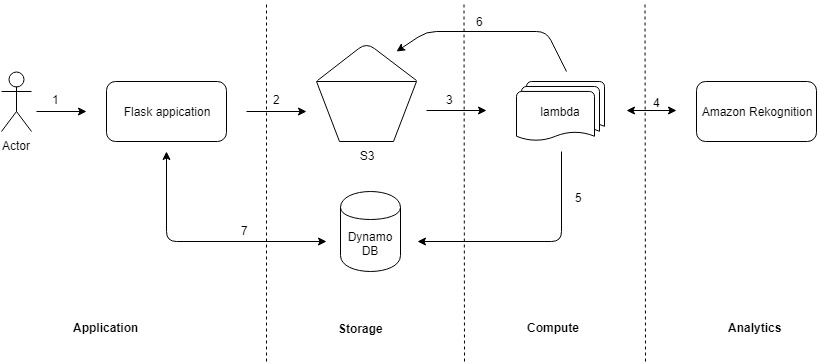

# Image processing using amazon service

**Use Case** 

1) User can upload an image via flask web application.
2) Images push into amazon s3 bucket.
3) Once image arrives in s3 bucket, lambda invokes.
4) Lambda instance will process these images to call amazon rekonition service to analyze the deatils.
5) Once amazon rekonition identifies and collect metadat about image, information stored into dynamodb.
6) At the same time it creates an thumbnail image and stores to s3 bucket.
7) User can view all the uploaded images metadata and their thumbnails. 

Amazon services used in this application,
1) S3
2) Lambda
3) Rekognition
4) Dynamodb
